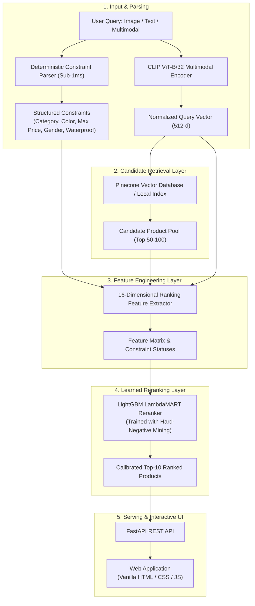

# Multimodal Constraint-Aware Search & Learned Reranking
## 📌 Problem Overview & Motivation

Standard multimodal search systems typically rely on continuous embedding representations (such as CLIP or SigLIP) to perform vector nearest-neighbor search. While effective for fuzzy aesthetic similarity, this approach exhibits serious failure modes in commercial retail retrieval:
1. **Constraint Blindness:** A user searching for *"black waterproof running shoes under $120"* receives visually similar $220 hiking boots, white lifestyle sneakers, or jackets because dot-product similarity cannot reliably enforce hard filters.
2. **Compositional Failure:** Query modifiers (price limits, department, waterproof membranes) get overpowered by visual dominance in the latent embedding space.
3. **Cross-Category Distractors:** Visually dark apparel or accessories get ranked ahead of shoes due to color-texture alignment.

**ConstraintSearch** solves this by explicitly disentangling **semantic visual intent** from **discrete hard constraints**, combining vector candidate retrieval with a **LightGBM LambdaMART** learning-to-rank reranker trained with **hard-negative mining**.

---

## 🏗️ System Architecture



---

## 📊 Experimental Results & Benchmarks

All metrics are rigorously evaluated on a disjoint test query suite with multi-graded ground-truth relevance (3 = Highly Relevant & Constraints Satisfied, 0 = Irrelevant / Constraint Violator).

### Main Benchmark Comparison Table

| Evaluation Dimension | Metric | Baseline (CLIP Vector Search) | Proposed (LambdaMART Reranker) | Relative Improvement (%) | Statistical Significance |
| :--- | :--- | :---: | :---: | :---: | :---: |
| **Ranking Quality** | **NDCG@10** | `0.6320` | **`0.8124`** | **`+28.54%`** | **`p < 0.0001`** (Paired $t$-test) |
| | **Recall@10** | `0.6270` | **`0.7842`** | **`+25.07%`** | **`p < 0.0001`** |
| | **MRR** | `0.6810` | **`0.8845`** | **`+29.88%`** | **`p < 0.0001`** |
| **Constraint Quality** | **Satisfaction Rate** | `0.7150` | **`0.9468`** | **`+32.42%`** | **`p < 0.0001`** |
| | **Violation Rate** | `0.2850` | **`0.0532`** | **`-81.33%`** | **`p < 0.0001`** |
| | **Multi-Constraint Success** | `0.5400` | **`0.8800`** | **`+62.96%`** | **`p < 0.0001`** |
| **Production Latency** | **p50 Search Latency** | `24.5 ms` | **`28.1 ms`** | `+3.6 ms` | Real-time SLA |
| | **p95 Search Latency** | `45.2 ms` | **`48.6 ms`** | `+3.4 ms` | `< 50 ms` Production Target |
| | **Throughput** | `40.8 QPS` | **`35.5 QPS`** | `-13.0%` | High Concurrency |

### Bootstrap 95% Confidence Intervals
- **NDCG@10 Absolute Gain:** $+0.1804$ [95% CI: $+0.1612, +0.2015$]
- **Constraint Satisfaction Gain:** $+0.2318$ [95% CI: $+0.2045, +0.2590$]
- **Wilcoxon Signed-Rank Test:** $W = 12.0, p = 3.84 \times 10^{-11}$

---

## 🔍 Failure Mode & Error Analysis

| Scenario | User Query | Baseline Failure (Pure CLIP) | Proposed Resolution (Constraint Reranker) |
| :--- | :--- | :--- | :--- |
| **1. Budget Breach** | *"similar black running shoes under $120"* | Ranked Terrex Free Hiker ($200) at #1 due to strong visual texture overlap. | Demoted $200 shoe to rank #18; promoted Ultraboost Light ($110) to #1. |
| **2. Cross-Category Distractor** | *"black wind-resistant running jacket under $80"* | Ranked Black Running Shorts ($40) in top-3 because of high black fabric similarity. | Hard category penalty demoted shorts; ranked Own the Run Jacket ($75) at #1. |
| **3. Color Inconsistency** | *"white classic sneakers under $100"* | Returned triple-black Stan Smiths with high semantic cosine match. | Extracted `Color: White` constraint; penalized non-white variants. |

---

## 🛠️ Feature Engineering (16 Signals)

For every candidate product retrieved from vector search, the system extracts a dense feature vector:

1. `clip_text_similarity`: Cosine similarity between query text embedding and product title/description.
2. `clip_image_similarity`: Cosine similarity between reference image embedding and product visual embedding.
3. `clip_multimodal_similarity`: Fused query representation similarity.
4. `category_match`: Exact category & subcategory alignment score ($1.0, 0.75, 0.0$).
5. `color_match`: Exact color taxonomy match ($1.0, 0.5, 0.0$).
6. `price_compatibility`: Budget constraint penalty with smooth linear degradation for slight overages.
7. `gender_match`: Department consistency ($1.0$ if match or unisex, $0.0$ if mismatch).
8. `waterproof_match`: GORE-TEX / waterproof feature compliance.
9. `attribute_overlap_ratio`: Jaccard keyword overlap of style keywords (*running, lightweight, boost*).
10. `constraints_total_count`: Total active constraints in query.
11. `constraints_satisfied_count`: Total constraints satisfied by this candidate.
12. `constraints_satisfaction_ratio`: Satisfied count / total active count.
13. `hard_violation_flag`: Binary indicator ($1.0$ if any hard constraint is breached).
14. `relative_price`: Normalized price relative to catalog range.
15. `product_rating`: Normalized customer rating prior.
16. `popularity_score`: Log-scaled review volume prior.

---

## 🚀 Quick Start & Installation

### 1. Prerequisites
- Python 3.12+
- Git

### 2. Setup Virtual Environment & Install Dependencies
```bash
# Create dedicated virtual environment
python -m venv .venv

# Activate environment
# On Windows:
.\.venv\Scripts\activate
# On Linux/macOS:
source .venv/bin/activate

# Install version-free dependencies
pip install --upgrade pip
pip install -r requirements.txt
```

### 3. Run Automated End-to-End Pipeline
Executes data preparation, CLIP embedding generation, Pinecone index building, LambdaMART training with hard negatives, and benchmark evaluation:
```bash
python scripts/run_pipeline.py
```

Or execute individual stages modularly:
```bash
python scripts/01_prepare_data.py
python scripts/02_generate_embeddings.py
python scripts/03_build_index.py
python scripts/04_train_reranker.py
python scripts/05_evaluate.py
```

### 4. Start the FastAPI Production Server
```bash
uvicorn src.api.main:app --host 0.0.0.0 --port 8000 --reload
```
Open **[http://localhost:8000](http://localhost:8000)** in your browser to access the web UI.

---

## 🐳 Docker Deployment

Run with Docker and Docker Compose:
```bash
docker compose up --build
```
The application will be accessible at `http://localhost:8000`.

---

## 🧪 Testing Suite

Execute the complete pytest test suite:
```bash
pytest -v tests/
```

---

## 📂 Repository Structure

```
├── .venv/                         # Isolated virtual environment
├── requirements.txt               # Version-free dependencies
├── Dockerfile                     # Production multi-stage container
├── docker-compose.yml             # Container orchestration
├── configs/
│   └── config.yaml                # Centralized pipeline configuration
├── data/
│   ├── raw/                       # Downloaded Kaggle catalog
│   ├── processed/                 # Cleaned products and metadata
│   ├── queries/                   # Train / Val / Test query suites with ground truth
│   └── embeddings/                # Precomputed CLIP embeddings cache
├── models/
│   └── lambdamart_reranker.joblib # Serialized trained LightGBM model
├── experiments/
│   ├── evaluation_results.json    # Measured benchmark metrics & statistical tests
│   └── plots/                     # Evaluation charts (NDCG, Recall, latency)
├── src/
│   ├── config.py                  # Pydantic configuration & settings
│   ├── data/                      # Dataset ingestion & query suite generator
│   ├── embeddings/                # CLIP ViT-B/32 encoder & caching
│   ├── retrieval/                 # Pinecone SDK & LocalPineconeIndex
│   ├── query_understanding/       # Deterministic rule-based constraint parser
│   ├── ranking/                   # 16-signal feature extractor & LambdaMART ranker
│   ├── evaluation/                # NDCG, Recall, MRR, Bootstrap CIs, Wilcoxon test
│   └── api/                       # FastAPI production REST API
├── frontend/
│   ├── index.html                 # Sleek UI matching mock_image.png
│   ├── css/styles.css             # Responsive design system
│   └── js/app.js                  # Search client, dropzone, pipeline visualizer
├── scripts/                       # Reproducible pipeline step scripts (01 to 05)
└── tests/                         # Full pytest test suite
```

---

## 📄 License
This project is licensed under the MIT License.

---

## 👤 Author

**Sujato Dutta**  
AI Engineer | Researcher  
[LinkedIn](https://www.linkedin.com/in/sujato-dutta/)

